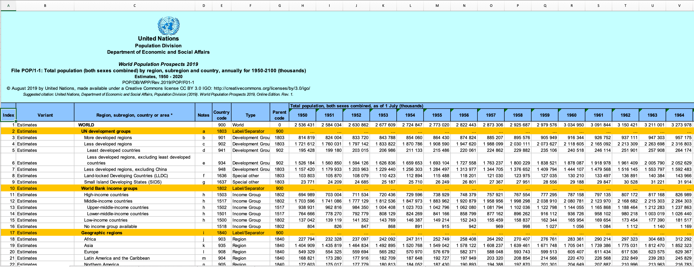
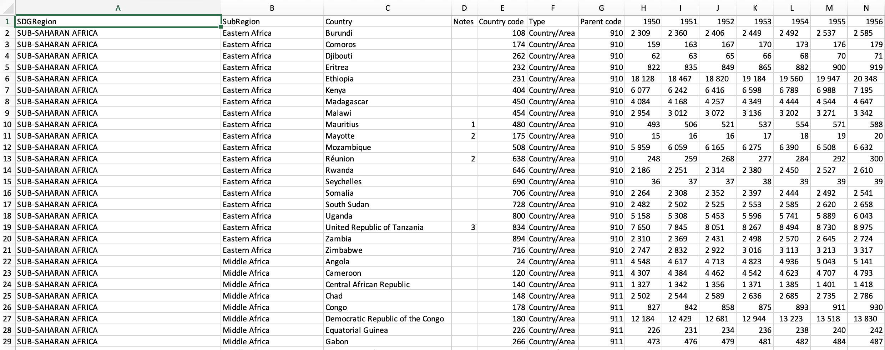

```{r init, include=FALSE}
# some of common options (and the defaults) are: 
# include=T, eval=T, echo=T, results='hide'/'asis'/'markup',..., collapse=F, warning=T, message=T, error=T, cache=T, fig.width=6, fig.height=4, fig.dim=c(6,4) #inches, fig.align='left'/'center','right', 
#Make sure you install the below packages by removing the comment - #
# install.packages("Rcpp")
# install.packages("tidyverse")
# install.packages("rworldmap")
# install.packages("tmap")
# install.packages("spData")
# install.packages("sf")
# install.packages("ggpubr")
library(ezids)
library(tidyverse) #install.packages("tidyverse")
library(rworldmap) #install.packages("rworldmap")
library(tmap) #install.packages("tmap")
library(sp) #install.packages("spData")
library(spData)
library(sf) #install.packages("sf")
library(ggpubr) #install.packages("ggpubr")
library(dplyr) #install.packages("dplyr")
library(knitr)
library(magrittr)
library(factoextra) #install.packages("factoextra")
library(cluster)
loadPkg("faraway")
# knitr::opts_chunk$set(warning = F, results = "markup", message = F)
knitr::opts_chunk$set(warning = FALSE, results = "show", message = F)
options(scientific=T, digits = 3) 
options(scipen=999)
# options(scipen=9, digits = 3) 
# ‘scipen’: integer. A penalty to be applied when deciding to print numeric values in fixed or exponential notation.  Positive values bias towards fixed and negative towards scientific notation: fixed notation will be preferred unless it is more than ‘scipen’ digits wider.
# use scipen=999 to prevent scientific notation at all times
```

# 1. Introduction

## Motivation

Climate issues are pervasive but typically disproportionately affect low income communities and developing countries. Our group wanted to explore how air pollution has changed over time and affect countries differently. Specifically, we wanted to analyze how a country's economic and social position can either increase, decrease, or not have observable impact on the affects of air pollution. In laymen terms, does air pollution affect underdeveloped countries disproportionately?

## Set Up

Before we start, we need to ensure that we have all the relevant libraries installed and imported.

Run these in the console, or only the ones that your system does not have, to install packages in addition to the ezids package.
```
install.packages("tidyverse")
install.packages("rworldmap")
install.packages("tmap")
install.packages("spData")
install.packages("sf")
install.packages("ggpubr")
install.packages("dplyr")
install.packages("knitr")
install.packages("magrittr")
```

# 2. Data Sources and Data Wrangling

## Data Sources
For our analysis, we will be working with 5 main data sources shown in the table below:


| Data                                                      | Source                | Link                                                                                       |
|-----------------------------------------------------------|-----------------------|--------------------------------------------------------------------------------------------|
| Deaths Due to Air Pollution of Countries from 1990 - 2017 | Kaggle                | [Link](https://www.kaggle.com/akshat0giri/death-due-to-air-pollution-19902017)             |
| GDP Annual Growth of Countries from 1960 - 2020           | Kaggle via WorldBank  | [Link](https://www.kaggle.com/zackerym/gdp-annual-growth-for-each-country-1960-2020)       |
| United Nations Population and Region Data                 | United Nations        | [Link](https://population.un.org/wpp/Download/Standard/Population/)                        |
| United Nations ISO-alpha3 code                            | United Nations        | [Link](https://unstats.un.org/unsd/methodology/m49/)                                       |
| spData for Map Geometries                                 | spData for Mapping    | [Link](https://nowosad.github.io/spData/)                                                  |
: Figure 1: Data Sources

The main variables in our datasets will include:

| Feature                         | Data Type               | Unit of Measure       | Notes and Assumptions                                                                      |
|---------------------------------|-------------------------|-----------------------|--------------------------------------------------------------------------------------------|
| GDP (Gross Domestic Product)    | Numerical, Continuous   | $USD                  | This is our chosen proxy for measuring a country's economic status                               |
| Population Size                 | Numerical, Continuous   | thousands of people   | Annual UN estimated                                                                        |
| Deaths due to Air Pollution     | Numerical, Continuous   | deaths per million    | This is our chosen proxy for measuring the negative affects of air pollution.              |
| Country                         | Qualitative, Categorical| N/A                   | 231 countries                                                                              |
| SDG Region                      | Qualitative, Categorical| N/A                   | UN's Sustainable Development Goals Region Classification.                                  |
| Sub Region                      | Qualitative, Categorical| N/A                   | UN's Sustainable Development Goals Sub-Region Classification.                              |
| ISO-alpha3 Country Code         | Qualitative, Categorical| N/A                   | Standard for identifying countries (text ID).                                              |
| ISO-alpha2 Country Code         | Qualitative, Categorical| N/A                   | Another standard for identifying countries (text ID).                                      |
| M49 Country Code                | Numerical, Categorical  | N/A                   | Another standard for identifying countries (numerical ID).                                 |
| Year                            | Numerical, Categorical  | N/A                   | 1990 to 2017                                                                               |
| GDP per Capita                  | Numerical, Continuous   | $USD per person       | Normalization of GDP to compare between population sizes (calculated).                     |
: Figure 2: Key Variables


## Data Wrangling
While data from Kaggle are already in a format to be cleaned, downloaded data from United Nations required a little data wrangling. Mainly, we needed to extract just countries' data from the Excel workbooks and into their own contained csv files. Since we only need to do this once and programming it would take significant time to choose the specific cells that we need, we opted to perform this step outside of R and in Excel. Note that if this were a part of a real production data pipeline, we would take the time to program the data extraction but would likely choose a different programming language such as Python that is a bit more robust in these types of tasks like web scraping and data transformations in Pandas.


: *Figure 3: Sample screenshot of data downloaded from UN including unnecessary elements like banners and other regional data.*



: *Figure 4: Sample screenshot of transformed UN dataset.*

# 3. Load, Clean, and Inspect Data

## Load Data

```{r 3.1, results =T, echo=F}
country_codes_df <- read.csv("data/country_codes.csv", header = TRUE, sep = ",")
air_pollution_df <- read.csv("data/death-rates-from-air-pollution.csv", header = TRUE, sep = ",")
gdp_df <- read.csv("data/GDP_annual_growth.csv", header = TRUE, sep = ",")
population_region_df <- read.csv("data/population_in_thousands_region.csv", header = TRUE, sep = ",")
```

```{r 3.2, results =T, echo=F}
#str(country_codes_df)
data.frame(variable = names(country_codes_df),
           class = sapply(country_codes_df, typeof),
           first_values = sapply(country_codes_df, function(x) paste0(head(x),  collapse = ", ")),
           row.names = NULL) %>% 
kable(caption='Figure 5: Structure of country_codes_df')
```

```{r 3.3, results =T, echo=F}
#str(air_pollution_df)
data.frame(variable = names(air_pollution_df),
           class = sapply(air_pollution_df, typeof),
           first_values = sapply(air_pollution_df, function(x) paste0(head(x),  collapse = ", ")),
           row.names = NULL) %>% 
kable(caption='Figure 6: Structure of air_pollution_df')
```


```{r 3.4, results =T, echo=F}
#str(gdp_df)
head(data.frame(variable = names(gdp_df),
           class = sapply(gdp_df, typeof),
           first_values = sapply(gdp_df, function(x) paste0(head(x),  collapse = ", ")),
           row.names = NULL), 10) %>% 
kable(caption='Figure 7: Structure of gdp_df, not showing all years in table to retain space but years go up to X2020')
```


```{r 3.5, results =T, echo=F}
#str(population_region_df)
head(data.frame(variable = names(population_region_df),
           class = sapply(population_region_df, typeof),
           first_values = sapply(population_region_df, function(x) paste0(head(x),  collapse = ", ")),
           row.names = NULL), 10) %>% 
kable(caption='Figure 8: Structure of population_region_df, not showing all years in table to retain space but years go up to X2020')
```


```{r 3.5.1, results =T, echo=F}
#str(world)
head(data.frame(variable = names(world),
           class = sapply(world, typeof),
           first_values = sapply(world, function(x) paste0(head(x),  collapse = ", ")),
           row.names = NULL), 10) %>% 
kable(caption='Figure 9: Structure of world, not showing geom feature in table as it has unique list of values per row and therefore is extremely large to display.')
```

## Clean Data

First thing that we need to drop unnecessary columns and set datatypes (factor, num, etc.).

### Clean *air_pollution_df*:
```{r 3.6, results =T, echo=F}
# Remove columns
air_pollution_df_cleaned <- subset(air_pollution_df, select = -c(Indoor.air.pollution..deaths.per.100.000., Outdoor.particulate.matter..deaths.per.100.000., Outdoor.ozone.pollution..deaths.per.100.000.))
# Set datatypes
air_pollution_df_cleaned$Entity = factor(air_pollution_df_cleaned$Entity)
air_pollution_df_cleaned$Code = factor(air_pollution_df_cleaned$Code)
air_pollution_df_cleaned$Year = factor(air_pollution_df_cleaned$Year)
# Rename columns
air_pollution_df_cleaned <- rename(air_pollution_df_cleaned, Country = Entity, ISO.alpha3.code = Code, Deaths.Air.Pollution.per.100k = Air.pollution..total...deaths.per.100.000.)
#str(air_pollution_df_cleaned)
data.frame(variable = names(air_pollution_df_cleaned),
           class = sapply(air_pollution_df_cleaned, typeof),
           first_values = sapply(air_pollution_df_cleaned, function(x) paste0(head(x),  collapse = ", ")),
           row.names = NULL) %>% 
kable(caption='Figure 10: Structure of air_pollution_df_cleaned')
```

### Clean *gdp_df*:
```{r 3.7, results =T, echo=F}
# Remove columns
gdp_df_cleaned <- subset(gdp_df, select = -c(Indicator.Name, Indicator.Code))
# Pivot wide to long dataset (data melt)
gdp_df_cleaned <- gdp_df_cleaned %>%
  pivot_longer(
    cols = starts_with("X"), 
    names_to = "Year", 
    values_to = "GDP.USD", 
    values_drop_na = TRUE
  )
# Remove characters from column
gdp_df_cleaned$Year<-gsub("X","",as.character(gdp_df_cleaned$Year))
# Set datatypes
gdp_df_cleaned$Country.Name = factor(gdp_df_cleaned$Country.Name)
gdp_df_cleaned$Country.Code = factor(gdp_df_cleaned$Country.Code)
gdp_df_cleaned$Year = factor(gdp_df_cleaned$Year)
# Rename columns
gdp_df_cleaned <- rename(gdp_df_cleaned, Country = Country.Name, ISO.alpha3.code = Country.Code)
#str(gdp_df_cleaned)
data.frame(variable = names(gdp_df_cleaned),
           class = sapply(gdp_df_cleaned, typeof),
           first_values = sapply(gdp_df_cleaned, function(x) paste0(head(x),  collapse = ", ")),
           row.names = NULL) %>% 
kable(caption='Figure 11: Structure of gdp_df_cleaned')
```

### Clean *population_region_df*:
```{r 3.8, results =T, echo=F}
# Remove columns
population_region_df_cleaned <- subset(population_region_df, select = -c(Notes, Type, Parent.code))
# Pivot wide to long dataset (data melt)
population_region_df_cleaned <- population_region_df_cleaned %>%
  pivot_longer(
    cols = starts_with("X"), 
    names_to = "Year", 
    values_to = "Population.thousands", 
    values_drop_na = TRUE
  )
# Remove characters from column
population_region_df_cleaned$Year<-gsub("X","",as.character(population_region_df_cleaned$Year))
population_region_df_cleaned <- as.data.frame(apply(population_region_df_cleaned, 2, function(x) gsub("\\s+", "", x))) 
# Set datatypes
population_region_df_cleaned$Country = factor(population_region_df_cleaned$Country)
population_region_df_cleaned$SDGRegion = factor(population_region_df_cleaned$SDGRegion)
population_region_df_cleaned$Country.code = factor(population_region_df_cleaned$Country.code)
population_region_df_cleaned$SubRegion = factor(population_region_df_cleaned$SubRegion)
population_region_df_cleaned$Year = factor(population_region_df_cleaned$Year)
population_region_df_cleaned$Population.thousands = as.numeric(population_region_df_cleaned$Population.thousands)
# Rename columns
population_region_df_cleaned <- rename(population_region_df_cleaned, M49.code = Country.code)
#str(population_region_df_cleaned)
data.frame(variable = names(population_region_df_cleaned),
           class = sapply(population_region_df_cleaned, typeof),
           first_values = sapply(population_region_df_cleaned, function(x) paste0(head(x),  collapse = ", ")),
           row.names = NULL) %>% 
kable(caption='Figure 12: Structure of population_region_df_cleaned')
```

### Clean *population_region_df*:
```{r 3.9, results =T, echo=F}
# Set datatypes
country_codes_df$M49.code = factor(country_codes_df$M49.code)
country_codes_df$Country.or.Area = factor(country_codes_df$Country.or.Area)
country_codes_df$ISO.alpha3.code = factor(country_codes_df$ISO.alpha3.code)
country_codes_df$ISO.alpha2.code = factor(country_codes_df$ISO.alpha2.code)
#str(country_codes_df)
data.frame(variable = names(country_codes_df),
           class = sapply(country_codes_df, typeof),
           first_values = sapply(country_codes_df, function(x) paste0(head(x),  collapse = ", ")),
           row.names = NULL) %>% 
kable(caption='Figure 13: Structure of country_codes_df')
```

### Clean *world*:
```{r 3.9.5, results =T, echo=F}
# Set datatypes
world$iso_a2 = factor(world$iso_a2)
# Remove columns
world_df_cleaned <- subset(world, select = c(iso_a2, geom))
#str(world_df_cleaned)
head(data.frame(variable = names(world_df_cleaned),
           class = sapply(world_df_cleaned, typeof),
           first_values = sapply(world_df_cleaned, function(x) paste0(head(x),  collapse = ", ")),
           row.names = NULL), 1) %>% 
kable(caption='Figure 14: Structure of world_df_cleaned, not showing geom feature in table as it has unique list of values per row and therefore is extremely large to display.')
```

Note that we only have geometries for 175 countries, some will not be able to be plot on a map but that is okay.

### Final DataFrame Construction
Now let's merge our 4 datasets into one using a series of inner joins using country code and year as keys depending on the specific join. We are using inner joins because we want to drop all null values which would mean either a country does not have a country code or we have more years of data than our smallest year range (the air pollution dataset).

```{r 3.10, results =T, echo=F}
# Join datasets
final_df <- merge(x = air_pollution_df_cleaned, y = country_codes_df, by = 'ISO.alpha3.code')
final_df <- merge(x = final_df, y = gdp_df_cleaned, by = c('ISO.alpha3.code', 'Year'))
final_df <- merge(x = final_df, y = population_region_df_cleaned, by = c('M49.code', 'Year'))
final_df <- merge(x = final_df, y = world_df_cleaned, by.x = 'ISO.alpha2.code', by.y = 'iso_a2', all.x = TRUE) #left join
# Remove columns
final_df <- subset(final_df, select = -c(Country.or.Area, Country.y, Country))
# Calculate GDP per capita 
final_df$gdp.per.capita <- final_df$GDP.USD / (final_df$Population.thousands * 1000)
#str(final_df)
data.frame(variable = names(final_df),
           class = sapply(final_df, typeof),
           first_values = sapply(final_df, function(x) paste0(head(x),  collapse = ", ")),
           row.names = NULL) %>% 
kable(caption='Figure 15: Structure of final_df')
```

```{r 3.11, include=TRUE, fig.align="center", echo=F}
# Convert to sf object so we can plot it on maps if needed
final_df_sf = st_as_sf(final_df)

# Choose relevant columns
final_df_sf_regions <- subset(final_df_sf, select = c(SDGRegion, SubRegion))
final_df_sf_intensities <- subset(final_df_sf, select = c(gdp.per.capita, Deaths.Air.Pollution.per.100k, Population.thousands))
```
Our dataset is finally ready to be analyzed.

# 4. EDA Summary

All necessary EDA was performed in the [Midterm Report](https://github.com/goebelclare/GitHub_Repo/blob/main/Midterm%20Project/Midterm-R_Markdown.html) where we looked at distributions for each key numerical variable in **Air Pollution Induced Deaths per 100k**, **Population**, **GDP per Capita**. We also looked into boxplots of these key numerical variables by **Regions** and **Sub Regions**. Interestingly, we observed that the same subregions that have low deaths caused by air pollution also have high GDP per capita comparatively.

Next, we checked for outliers and found that Deaths.Air.Pollution.per.100k definitely do not need to have outliers removed as it only represents 0.7% of the dataset. gdp.per.capita have higher percentage of classified outliers at 13.5%, however, we felt that keeping the extreme datapoints of this feature was important in our research and analysis to capture the true disproportionate distribution of wealth and progress across countries in our world.

Lastly, we explored a few choropleth maps to visually understand our dataset better.

We intentionally did not include any figures from EDA in this final report to preserve space. Please look at the [Midterm Report](https://github.com/goebelclare/GitHub_Repo/blob/main/Midterm%20Project/Midterm-R_Markdown.html) for details on our entire EDA process.

# 5. Main Research Question

Below is a rehash of our main research question from the Midterm report and we felt that the findings from this model was important enough to warrant inclusion in this final report as well.

## Do lower GDP countries have more deaths per 100k due to air pollution?

### Is there a correlation between GDP per capita and deaths caused by pollution? Is it linear? How strong is the correlation?

#### Linear Fit
Let's first look at the general fit on the overall data.

```{r 5.1, include=TRUE, fig.align="center", echo=F}
fit1 <- lm(Deaths.Air.Pollution.per.100k ~ gdp.per.capita, data=final_df_sf)
ggplot(final_df_sf, aes(gdp.per.capita, Deaths.Air.Pollution.per.100k)) +
  geom_point() +
  geom_smooth(method='lm', se=FALSE) +
  stat_regline_equation(label.y = 400, aes(label = ..eq.label..)) +
  stat_regline_equation(label.y = 350, aes(label = ..rr.label..))
```
: *Figure 15: Linear model (fit1) on overall data, deaths due to air pollution per 100k vs GDP per capita, 1990 to 2017.*

From the plot, we observed that there is indeed a negative correlation between deaths due to air pollution per 100k and GDP per capita. However, the strength of that relationship is not particularly strong as the R^2^ is really low at `r summary(fit1)$r.squared`. This means that only 29% of the variance experienced in deaths due to air pollution per 100k is caused by GDP per capita in a linear relationship.

#### Transformed Log Scale - Linear Fit

We then performed a log transformation and found that our linear regression fits much better.

fit2's summary statistics are:

```{r 5.3, include=TRUE, fig.align="center", echo=F}
fit2 <- lm(log(Deaths.Air.Pollution.per.100k) ~ log(gdp.per.capita), data=final_df_sf)
summary(fit2)
# print(vif(fit2))
```

We re-plotted the linear model and here were the results.

```{r 5.3.3, include=TRUE, fig.align="center", echo=F}
ggplot(final_df_sf, aes(log(gdp.per.capita), log(Deaths.Air.Pollution.per.100k))) +
  geom_point() +
  geom_smooth(method='lm', se=FALSE) +
  stat_regline_equation(label.y = 7, aes(label = ..eq.label..)) +
  stat_regline_equation(label.y = 6, aes(label = ..rr.label..))
```
: *Figure 16: Fitting to a log(y) = (m)(log(x)) + b curve yields much stronger relationship.*

Across the board, the strength of our linear relationship increases dramatically when first transforming both features by the log() function first. The new R^2^ is now `r summary(fit2)$r.squared` which means around 74% of the variance in our target feature can be explained by this mathematical relationship.

We can then predict a country's deaths caused from air pollution in a given year by using the country's GDP per capita with the following equation: 


$$
log(Deaths_{from~air~pollution|per~year|per~country} / 100,000) = 7.38778 - 0.38952 * log(GDP_{per capita}) ~~~~~~~~~~~~~~~~  eqn (1)
$$

or solving for our target variable:


$$
Deaths_{from~air~pollution|per~year|per~country} = 10^{7.38778 - 0.38952 * log(GDP per capita)} * 100,000 ~~~~~~~~~~~~~~~~ eqn (2)
$$

### Is there a difference in means of death caused by pollution between low, mid, and high GDP per capita?

We all know that correlation does not necessarily mean causation. Let us dig a little deeper and test if means of deaths caused by air pollution per 100k across different GDP per capita levels are equal or not.

#### One-Way ANOVA Test

We started off by performing a One-Way ANOVA test to determine if the means of deaths caused by air pollution per 100k across different GDP per capita levels are equal or not.

H~0~: $\mu$~deaths_lowest_gdp~ = $\mu$~deaths_low_gdp~ = $\mu$~deaths_medium_gdp~ = $\mu$~deaths_high_gdp~

H~1~: At least one of $\mu$~deaths_lowest_gdp~, $\mu$~deaths_low_gdp~, $\mu$~deaths_medium_gdp~, $\mu$~deaths_high_gdp~ is not equal

We will use an $\alpha$ value of 0.05.

```{r Q5.9, include=TRUE, echo=F}
# divide df$am.spent 
final_df_sf$qnt <- cut(final_df_sf$gdp.per.capita , breaks=quantile(final_df_sf$gdp.per.capita, na.rm = TRUE),
                                    labels=1:4, include.lowest=TRUE)
# check ranges
tapply(final_df_sf$gdp.per.capita , final_df_sf$qnt , range)
deaths_aov = aov(Deaths.Air.Pollution.per.100k ~ qnt, data=final_df_sf)
deaths_aovsummary = summary(deaths_aov)
deaths_aovsummary
p = deaths_aovsummary[[1]][["Pr(>F)"]][[1]]
```
The p-value~test1~ is `r format(p, scientific=T)`, which is lower than $\alpha$~0.05~. Therefore, we reject our null hypothesis that $\mu$~deaths_lowest_gdp~ = $\mu$~deaths_low_gdp~ = $\mu$~deaths_medium_gdp~ = $\mu$~deaths_high_gdp~. This means that there is statistically significant that at least one of the means of deaths in low, medium, and high GDP per capita are not the same. 

#### 2-Sample T-Tests

We will conduct 6 2-sample t-tests to determine if each of the groupings are different from each other:

* Lowest GDP per capita's deaths does not equal Low GDP per capita's deaths
    + H~0~: $\mu$~deaths_lowest_gdp~ = $\mu$~deaths_low_gdp~
    + H~1~: $\mu$~deaths_lowest_gdp~ != $\mu$~deaths_low_gdp~
* Low GDP per capita's deaths does not equal Medium GDP per capita's deaths
    + H~0~: $\mu$~deaths_low_gdp~ = $\mu$~deaths_medium_gdp~
    + H~1~: $\mu$~deaths_low_gdp~ != $\mu$~deaths_medium_gdp~
* Medium GDP per capita's deaths does not equal High GDP per capita's deaths
    + H~0~: $\mu$~deaths_medium_gdp~ = $\mu$~deaths_high_gdp~
    + H~1~: $\mu$~deaths_medium_gdp~ != $\mu$~deaths_high_gdp~
* Lowest GDP per capita's deaths does not equal High GDP per capita's deaths
    + H~0~: $\mu$~deaths_lowest_gdp~ = $\mu$~deaths_high_gdp~
    + H~1~: $\mu$~deaths_lowest_gdp~ != $\mu$~deaths_high_gdp~
* Lowest GDP per capita's deaths does not equal Medium GDP per capita's deaths
    + H~0~: $\mu$~deaths_lowest_gdp~ = $\mu$~deaths_medium_gdp~
    + H~1~: $\mu$~deaths_lowest_gdp~ != $\mu$~deaths_medium_gdp~
* Low GDP per capita's deaths does not equal Highest GDP per capita's deaths
    + H~0~: $\mu$~deaths_low_gdp~ = $\mu$~deaths_high_gdp~
    + H~1~: $\mu$~deaths_low_gdp~ != $\mu$~deaths_high_gdp~
    
We used a two sample t-test for each and used an $\alpha$ value of 0.05.

**Test 1**:

Conclusion of test1: p-value~test1~ is less than $\alpha$~0.05~, therefore we reject our null hypothesis that $\mu$~deaths_lowest_gdp~ is equal to $\mu$~deaths_low_gdp~ and accept our alternative hypothesis.

**Test 2**:

Conclusion of test2: p-value~test2~ is less than $\alpha$~0.05~, therefore we reject our null hypothesis that $\mu$~deaths_low_gdp~ is equal to $\mu$~deaths_medium_gdp~ and accept our alternative hypothesis.

**Test 3**:

Conclusion of test3: p-value~test3~ is less than $\alpha$~0.05~, therefore we reject our null hypothesis that $\mu$~deaths_medium_gdp~ is equal to $\mu$~deaths_high_gdp~ and accept our alternative hypothesis.

**Test 4**:

Conclusion of test4: p-value~test4~ is less than $\alpha$~0.05~, therefore we reject our null hypothesis that $\mu$~deaths_lowest_gdp~ is equal to $\mu$~deaths_high_gdp~ and accept our alternative hypothesis.

**Test 5**:

Conclusion of test5: p-value~test5~ is less than $\alpha$~0.05~, therefore we reject our null hypothesis that $\mu$~deaths_lowest_gdp~ is equal to $\mu$~deaths_medium_gdp~ and accept our alternative hypothesis.

**Test 6**:

Conclusion of test6: p-value~test6~ is less than $\alpha$~0.05~, therefore we reject our null hypothesis that $\mu$~deaths_low_gdp~ is equal to $\mu$~deaths_high_gdp~ and accept our alternative hypothesis.

###  Midterm Main Research Results
From all of our tests above, we can confirm that the means of deaths caused by air pollution are statistically significant when grouped by different levels of GDP per capita. This reinforces the idea that deaths caused by air pollution has a significant relationship with GDP per capita and the model can be quantified by *Equation 2*:

$$
Deaths_{from~air~pollution|per~year|per~country} = 10^{7.38778 - 0.38952 * log(GDP per capita)} * 100,000 ~~~~~~~~~~~~~~~~ eqn (2)
$$

The strength of the correlation can be quantified by our R^2^ value of `r summary(fit2)$r.squared` from Figure 16.

# 6. Smart Questions for Further Modeling 

### 1. What are the impacts of population size from GDP and Deaths due to Air Pollution globally?

1. Categorizing GDP into low, medium and high 

2. Bulding a logit model GDP as predictor on Population  

```{r}
pop_gdpLogit <- glm(final_df$Population.thousands ~ final_df$gdp.per.capita, data = final_df)
```
```{r}
summary(pop_gdpLogit)
```  
```{r}
xkabledply(pop_gdpLogit, title = paste("Logistic Regression :", format(formula(pop_gdpLogit)) ))
```

3. Bulding a logit model GDP and Deaths due to Air Population as predictor on Population  

```{r}
pop_gdp_deathsLogit <- glm(final_df$Population.thousands ~ final_df$gdp.per.capita, final_df$Deaths.Air.Pollution.per.100k, data = final_df)
```
```{r}
summary(pop_gdp_deathsLogit)
```  
```{r}
xkabledply(pop_gdp_deathsLogit, title = paste("Logistic Regression :", format(formula(pop_gdp_deathsLogit)) ))


### 2. What are the effects of (low or high) GDP and population size on deaths due to air pollution in Sub-Saharan Africa?

### 3. Can we let the data tell us what type of groupings exist in our dataset? How consistent are they to our preconceived groupings such as region or developed vs developing countries? 

We wanted to better understand what types of groupings exist within our dataset. More concretely, we wanted to put aside our preconceived presumptions about our dataset and create a *K-Means clustering model* and allow the the data to guide us to the possible clusters that may exist within our data.

*K-Means clustering* is an unsupervised machine learning algorithm that is very useful to parse the dataset and identify *K* number of groups where observations within each group have high similarity. 

First, let's create an index label.

```{r Q6.3.0, include=TRUE, echo=F}
final_df_cluster <- final_df

final_df_cluster$index <- paste(final_df_cluster$Country.x, final_df_cluster$AD, sep="")

final_df_cluster <- final_df_cluster %>% select(index, Deaths.Air.Pollution.per.100k, gdp.per.capita, SDGRegion, Population.thousands)
final_df_cluster = aggregate(final_df_cluster, by=list(index_=final_df_cluster$index, region=final_df_cluster$SDGRegion), FUN=mean)

final_df_cluster <- subset(final_df_cluster, select = -c(index, SDGRegion))

final_df_cluster <- final_df_cluster[!duplicated(final_df_cluster$index_),]

rownames(final_df_cluster) <- final_df_cluster$index_

#head(final_df_cluster)
```
Next, let's select only the numerical values from our dataset.

```{r Q6.3.1, include=TRUE, echo=F}
final_df_numerical <- select_if(final_df_cluster, is.numeric)  

#remove rows with missing values
final_df_numerical <- na.omit(final_df_numerical)

#str(final_df_numerical)
data.frame(variable = names(final_df_numerical),
           class = sapply(final_df_numerical, typeof),
           first_values = sapply(final_df_numerical, function(x) paste0(head(x),  collapse = ", ")),
           row.names = NULL) %>% 
kable(caption='Figure 6.3-1: Structure of final_df_numerical')
```

#### Optimal *K* Clusters
Let's try to find the optimal *K* value to achieve best clustering results. The 2 that we will try are using: 

1. Elbow Method with Total Within Sum of Squares  
2. Looking at the Gap Statistics

*Elbow Method with Total Within Sum of Squares*

```{r Q6.3.2, include=TRUE, echo=F}
final_df_numerical_scaled <- scale(final_df_numerical)
fviz_nbclust(final_df_numerical_scaled, kmeans, method = "wss")+ 
  geom_vline(xintercept = 4, linetype = 2)+ 
  geom_vline(xintercept = 7, linetype = 2)
```
: *Figure 6.3-2: Finding the optimal number of clusters using the Within Sum of Squares Method.*

From the total Within Sum of Squares plot, we find that the optimal number of *K* seems to be at 4 using the Elbow method which identifies the *K* number where the Total Sum of Squares begins to level off, or where adding additional *K* clusters only improves our model marginally.

*Looking at the Gap Statistics*

```{r Q6.3.3, include=TRUE, echo=F}
#calculate gap statistic based on number of clusters
gap_stat <- clusGap(final_df_numerical_scaled,
                    FUN = kmeans,
                    nstart = 25,
                    K.max = 10,
                    B = 50)

#plot number of clusters vs. gap statistic
fviz_gap_stat(gap_stat)+ 
  geom_vline(xintercept = 4, linetype = 2)+ 
  geom_vline(xintercept = 7, linetype = 2)
```
: *Figure 6.3-3: Finding the optimal number of clusters using the Gap Statistic.*

From the Gap Statistic plot, we find that the optimal number of *K* seems to be at 10 with the highest gap statistic, however, we observed using the Elbow method that the Total Sum of Squares begins to level off from 4 to 10. We will stick with using *K* = 4.

#### Perform K-Means Clustering with Optimal *K*

We perform a K-Means clustering analysis with a *K* of 4 and here are the results below.


```{r Q6.3.4, include=TRUE, echo=F}
#make this example reproducible
set.seed(42)

#perform k-means clustering with k = 4 clusters
km <- kmeans(final_df_numerical_scaled, centers = 4, nstart = 25)

km_centers = km$centers
km_centers <- cbind(Cluster = rownames(km_centers), km_centers)
rownames(km_centers) <- 1:nrow(km_centers)

xkabledply(km_centers, title="Figure 6.3-4: K-Means Clustering Average Values per Cluster")
```
```{r Q6.3.5, include=TRUE, echo=F}
#view results
km_size = as.data.frame(km$size)
colnames(km_size) <- c("Observations with Each Cluster")

km_size <- cbind(Cluster = rownames(km_size), km_size)
rownames(km_size) <- 1:nrow(km_size)

xkabledply(km_size, title="Figure 6.3-5: Number of Observations Within Each Cluster")
```

```{r Q6.3.6, include=TRUE, echo=F}
#view results
km_withinss= as.data.frame(km$withinss)
colnames(km_withinss) <- c("Total Sum of Squares with Each Cluster")

km_withinss <- cbind(Cluster = rownames(km_withinss), km_withinss)
rownames(km_withinss) <- 1:nrow(km_withinss)

xkabledply(km_withinss, title="Figure 6.3-6: Total Sum of Squares Within Each Cluster")
```

Let's take a look at clusters visually. Interestingly, our model has grouped China and India into their own separate cluster, Cluster 2. Clusters 4, 3, and 1 can be roughly characterized by high GDP per captita nations, medium GDP per capita nations, and low GDP per capita nations'. 

```{r Q6.3.7, include=TRUE, echo=F}
#plot results of final k-means model
fviz_cluster(km, data = final_df_numerical_scaled)
```
: *Figure 3.6-7: Visualing K-Means Clustering Model.*

Let's take a closer look at each cluster's breakdown of subregions more closely to determine what type of discrepancies we find between each cluster.

```{r Q6.3.8, include=TRUE, echo=F}
kmeans_basic_df <- data.frame(Cluster = km$cluster, final_df_cluster)

kmeans_group_df = kmeans_basic_df %>%
  group_by(Cluster, region) %>%
  summarize(Percentage=n() / nrow(.) )

# head of df
#head(kmeans_group_df)

# Stacked + percent
ggplot(data = kmeans_group_df, aes(fill=region, y=Percentage, x=Cluster)) + 
    geom_bar(position="fill", stat="identity")+
  ggtitle("Frequency % of SDGRegion by Clusters") +
  theme(plot.title = element_text(hjust = 0.5))
```
: *Figure 6.3-8: Frequency % of SDGRegion by Clusters.*

Interestingly, we observe that Cluster 1 is disproportionately comprised of countries in Sub-Saharan Africa with large representations from Oceania, Eastern & South-Eastern Asia, and Central & Southern Asia. Cluster 2 is the one cluster comprised solely of China and India. Cluster 3 has a much larger proportion of countries from Europe, Northen America, and Northern Africa & Western Asia. Cluster 4 is similar to Cluster 3 except it does not have countries from Northern America and has more countries from Sub-Saharan Africa and Central & Southern Asia. 

### 4. Can we make a prediction of the future GDP by considering the population size, location, and the reation of population and deaths due to air pollution? 

# 7. Conclusion SMART Modeling

1.

2.

3. For the clustering, it is really interesting to observe that the main clusters 1, 3, and 4 have large discrepancies in regional representation while the data we used for clustering did not have any explicit geospatial components. This can mean that regionality, although may not be the cause, does have some correlation in determining the groups of factors in *GDP per Capita*, *Population*, and *Deaths due to Air Pollution per 100k*.

4.

# 8. Bibliography

| Number                                                      | APA Citation                                                                                       |
|-----------------------------------------------------------|--------------------------------------------------------------------------------------------|
| 1                                        | Robin Lovelace, J. N. (n.d.). Chapter 8 Making maps with R: Geocomputation with R. Retrieved October 28, 2021, from https://geocompr.robinlovelace.net/adv-map.html                                  |
| 2                                     | Robin Lovelace, J. N. (2021, October 28). Chapter 2 Geographic data in R: Geocomputation with R. Retrieved from https://geocompr.robinlovelace.net/spatial-class.html#intro-sf                     |
| 3                                          | Hadley Wickham, D. N. (2021, October 28). 6 Maps. Retrieved from https://ggplot2-book.org/maps.html                                                |
| 4                                      | Customizing ggplot2 color and fill scales. (2021, October 28). Retrieved from https://spielmanlab.github.io/introverse/articles/color_fill_scales.html           |
| 5                                          | Logarithmic Functions. (2021, October 28). Retrieved from https://saylordotorg.github.io/text_intermediate-algebra/s10-03-logarithmic-functions-and-thei.html         |
| 6                                          | K-Means Clustering in R. (2021, December 3). Retrieved from https://www.statology.org/k-means-clustering-in-r/         |
: Figure 8.1: References
