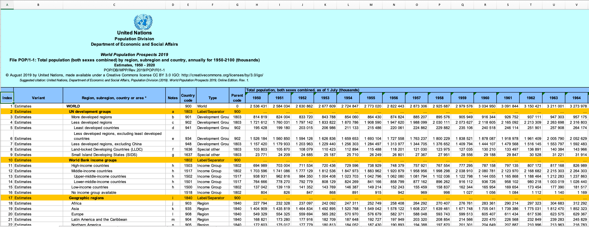
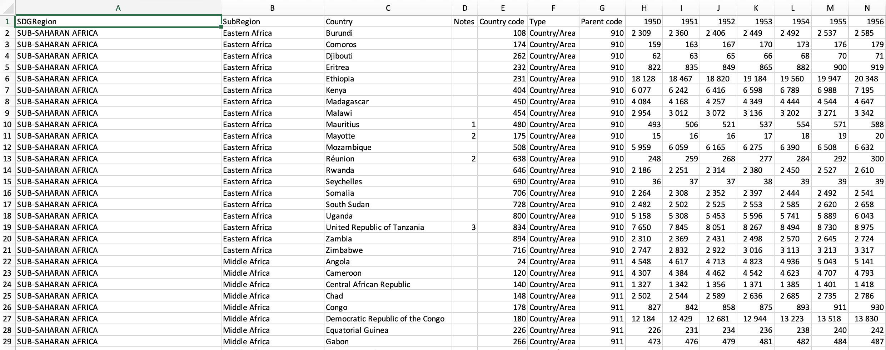

```{r init, include=FALSE}
# some of common options (and the defaults) are: 
# include=T, eval=T, echo=T, results='hide'/'asis'/'markup',..., collapse=F, warning=T, message=T, error=T, cache=T, fig.width=6, fig.height=4, fig.dim=c(6,4) #inches, fig.align='left'/'center','right', 

library(ezids)
library(tidyverse) #install.packages("tidyverse")
library(rworldmap) #install.packages("rworldmap")
library(tmap) #install.packages("tmap")
library(sp) #install.packages("spData")
library(spData)
library(sf) #install.packages("sf")
library(ggpubr) #install.packages("ggpubr")
loadPkg("faraway")

# knitr::opts_chunk$set(warning = F, results = "markup", message = F)
knitr::opts_chunk$set(warning = F, results = "hide", message = F)
options(scientific=T, digits = 3) 
# options(scipen=9, digits = 3) 
# ‘scipen’: integer. A penalty to be applied when deciding to print numeric values in fixed or exponential notation.  Positive values bias towards fixed and negative towards scientific notation: fixed notation will be preferred unless it is more than ‘scipen’ digits wider.
# use scipen=999 to prevent scientific notation at all times
```

# 1. Introduction

## Motivation

Air pollution affects **blah blah blah...** and with the increased worsening in climate and air quality, **blah blah blah...**. Our group wanted to explore how air pollution has changed over time and affect countries differently. Specifically, we wanted to analyze how a country's progress can either increase, decrease, or not have observable impact on the affects of air pollution. In laymen terms, does air pollution affect underdeveloped countries disproportionately?

## Set Up

Before we start, we need to ensure that we have all the relevant libraries installed and imported.

Run these in the console to install packages in addition to the ezids package.
```
install.packages("tidyverse")
install.packages("rworldmap")
install.packages("tmap")
install.packages("spData")
install.packages("sf")
install.packages("ggpubr")
```

# 2. Data Sources and Data Wrangling

## Data Sources
For our analysis, we will be working with 5 main data sources shown in the table below:


| Data                                                      | Source                | Link                                                                                       |
|-----------------------------------------------------------|-----------------------|--------------------------------------------------------------------------------------------|
| Deaths Due to Air Pollution of Countries from 1990 - 2017 | Kaggle                | [Link](https://www.kaggle.com/akshat0giri/death-due-to-air-pollution-19902017)             |
| GDP Annual Growth of Countries from 1960 - 2020           | Kaggle via WorldBank  | [Link](https://www.kaggle.com/zackerym/gdp-annual-growth-for-each-country-1960-2020)       |
| United Nations Population and Region Data                 | United Nations        | [Link](https://population.un.org/wpp/Download/Standard/Population/)                        |
| United Nations ISO-alpha3 code                            | United Nations        | [Link](https://unstats.un.org/unsd/methodology/m49/)                                       |
| spData for Map Geometries                                 | spData for Mapping    | [Link](https://nowosad.github.io/spData/)                                                  |
: Fig 1: Data Sources

The main features in our datasets will include:

| Feature                         | Data Type               | Unit of Measure       | Notes and Assumptions                                                                      |
|---------------------------------|-------------------------|-----------------------|--------------------------------------------------------------------------------------------|
| GDP (Gross Domestic Product)    | Numerical, Continuous   | $USD                  | This is our chosen proxy for measuring a country's progress.                               |
| Population Size                 | Numerical, Continuous   | thousands of people   | Annual UN estimated                                                                        |
| Deaths due to Air Pollution     | Numerical, Continuous   | deaths per million    | This is our chosen proxy for measuring the negative affects of air pollution.              |
| Country                         | Qualitative, Categorical| N/A                   | 231 countries                                                                              |
| SDG Region                      | Qualitative, Categorical| N/A                   | UN's Sustainable Development Goals Region Classification.                                  |
| Sub Region                      | Qualitative, Categorical| N/A                   | UN's Sustainable Development Goals Sub-Region Classification.                              |
| ISO-alpha3 Country Code         | Qualitative, Categorical| N/A                   | Standard for identifying countries (text ID).                                              |
| ISO-alpha2 Country Code         | Qualitative, Categorical| N/A                   | Another standard for identifying countries (text ID).                                      |
| M49 Country Code                | Numerical, Categorical  | N/A                   | Another standard for identifying countries (numerical ID).                                 |
| Year                            | Numerical, Categorical  | N/A                   | 1990 to 2017                                                                               |
| GDP per Capita                  | Numerical, Continuous   | $USD per person       | Normalization of GDP to compare between population sizes (calculated).                     |
: Fig 2: Key Features


## Data Wrangling
While data from Kaggle are already in a format to be cleaned, downloaded data from United Nations required a little data wrangling. Mainly, we needed to extract just countries' data from the Excel workbooks and into their own contained csv files. Since we only need to do this once and programming it would take significant time to choose the specific cells that we need, we opted to perform this step outside of R and in Excel. Note that if this were a part of a real production data pipeline, we would take the time to program the data extraction but would likely choose a different programming language such as Python that is a bit more robust in these types of tasks like web scraping and data transformations in Pandas.


: *Fig 3: Sample screenshot of data downloaded from UN including unnecessary elements like banners and other regional data.*



: *Fig 4: Sample screenshot of transformed UN dataset.*

# 3. Load, Clean, and Inspect Data

## Load Data

```{r 3.1, include=TRUE}
country_codes_df <- read.csv("data/country_codes.csv", header = TRUE, sep = ",")
air_pollution_df <- read.csv("data/death-rates-from-air-pollution.csv", header = TRUE, sep = ",")
gdp_df <- read.csv("data/GDP_annual_growth.csv", header = TRUE, sep = ",")
population_region_df <- read.csv("data/population_in_thousands_region.csv", header = TRUE, sep = ",")
```

```{r 3.2, include=TRUE}
str(country_codes_df)
```

```{r 3.3, include=TRUE}
str(air_pollution_df)
```

```{r 3.4, include=TRUE}
str(gdp_df)
```

```{r 3.5, include=TRUE}
str(population_region_df)
```

```{r 3.5.1, include=TRUE}
str(world)
```

## Clean Data

First thing that we need to drop unnecessary columns and set datatypes (factor, num, etc.).

### Clean *air_pollution_df*:
```{r 3.6, include=TRUE}
# Remove columns
air_pollution_df_cleaned <- subset(air_pollution_df, select = -c(Indoor.air.pollution..deaths.per.100.000., Outdoor.particulate.matter..deaths.per.100.000., Outdoor.ozone.pollution..deaths.per.100.000.))

# Set datatypes
air_pollution_df_cleaned$Entity = factor(air_pollution_df_cleaned$Entity)
air_pollution_df_cleaned$Code = factor(air_pollution_df_cleaned$Code)
air_pollution_df_cleaned$Year = factor(air_pollution_df_cleaned$Year)

# Rename columns
air_pollution_df_cleaned <- rename(air_pollution_df_cleaned, Country = Entity, ISO.alpha3.code = Code, Deaths.Air.Pollution.per.100k = Air.pollution..total...deaths.per.100.000.)

str(air_pollution_df_cleaned)
```

### Clean *gdp_df*:
```{r 3.7, include=TRUE}
# Remove columns
gdp_df_cleaned <- subset(gdp_df, select = -c(Indicator.Name, Indicator.Code))

# Pivot wide to long dataset (data melt)
gdp_df_cleaned <- gdp_df_cleaned %>%
  pivot_longer(
    cols = starts_with("X"), 
    names_to = "Year", 
    values_to = "GDP.USD", 
    values_drop_na = TRUE
  )

# Remove characters from column
gdp_df_cleaned$Year<-gsub("X","",as.character(gdp_df_cleaned$Year))

# Set datatypes
gdp_df_cleaned$Country.Name = factor(gdp_df_cleaned$Country.Name)
gdp_df_cleaned$Country.Code = factor(gdp_df_cleaned$Country.Code)
gdp_df_cleaned$Year = factor(gdp_df_cleaned$Year)

# Rename columns
gdp_df_cleaned <- rename(gdp_df_cleaned, Country = Country.Name, ISO.alpha3.code = Country.Code)

str(gdp_df_cleaned)
```

### Clean *population_region_df*:
```{r 3.8, include=TRUE}
# Remove columns
population_region_df_cleaned <- subset(population_region_df, select = -c(Notes, Type, Parent.code))

# Pivot wide to long dataset (data melt)
population_region_df_cleaned <- population_region_df_cleaned %>%
  pivot_longer(
    cols = starts_with("X"), 
    names_to = "Year", 
    values_to = "Population.thousands", 
    values_drop_na = TRUE
  )

# Remove characters from column
population_region_df_cleaned$Year<-gsub("X","",as.character(population_region_df_cleaned$Year))
population_region_df_cleaned <- as.data.frame(apply(population_region_df_cleaned, 2, function(x) gsub("\\s+", "", x))) 

# Set datatypes
population_region_df_cleaned$Country = factor(population_region_df_cleaned$Country)
population_region_df_cleaned$SDGRegion = factor(population_region_df_cleaned$SDGRegion)
population_region_df_cleaned$Country.code = factor(population_region_df_cleaned$Country.code)
population_region_df_cleaned$SubRegion = factor(population_region_df_cleaned$SubRegion)
population_region_df_cleaned$Year = factor(population_region_df_cleaned$Year)
population_region_df_cleaned$Population.thousands = as.numeric(population_region_df_cleaned$Population.thousands)

# Rename columns
population_region_df_cleaned <- rename(population_region_df_cleaned, M49.code = Country.code)

str(population_region_df_cleaned)
```

### Clean *population_region_df*:
```{r 3.9, include=TRUE}
# Set datatypes
country_codes_df$M49.code = factor(country_codes_df$M49.code)
country_codes_df$Country.or.Area = factor(country_codes_df$Country.or.Area)
country_codes_df$ISO.alpha3.code = factor(country_codes_df$ISO.alpha3.code)
country_codes_df$ISO.alpha2.code = factor(country_codes_df$ISO.alpha2.code)

str(country_codes_df)
```

### Clean *world*:
```{r 3.9.5, include=TRUE}
# Set datatypes
world$iso_a2 = factor(world$iso_a2)

# Remove columns
world_df_cleaned <- subset(world, select = c(iso_a2, geom))

str(world_df_cleaned)
```

Note that we only have geometries for 175 countries, some will not be able to be plot on a map but that is okay.

### Final DataFrame Construction
Now let's merge our 4 datasets into one using a series of inner joins using country code and year as keys depending on the specific join. We are using inner joins because we want to drop all null values which would mean either a country does not have a country code or we have more years of data than our smallest year range (the air pollution dataset).

```{r 3.10, include=TRUE}
# Join datasets
final_df <- merge(x = air_pollution_df_cleaned, y = country_codes_df, by = 'ISO.alpha3.code')
final_df <- merge(x = final_df, y = gdp_df_cleaned, by = c('ISO.alpha3.code', 'Year'))
final_df <- merge(x = final_df, y = population_region_df_cleaned, by = c('M49.code', 'Year'))
final_df <- merge(x = final_df, y = world_df_cleaned, by.x = 'ISO.alpha2.code', by.y = 'iso_a2', all.x = TRUE) #left join

# Remove columns
final_df <- subset(final_df, select = -c(Country.or.Area, Country.y, Country))

# Calculate GDP per capita 
final_df$gdp.per.capita <- final_df$GDP.USD / final_df$Population.thousands

str(final_df)
```

Our dataset is finally ready to be analyzed.

# 4. EDA - Exploratory Data Analysis

## Quick Plots

Let's start our EDA process by just looking at some quick plots to look at the distribution of data.

### Histogram of Numerical Features
```{r 4.1, include=TRUE, fig.align="center"}
ggplot() + geom_histogram(data = final_df, aes(x = Deaths.Air.Pollution.per.100k))  +
  labs(title = "Distribution of Deaths per 100k from Air Polution")
ggplot() + geom_histogram(data = final_df, aes(x = Population.thousands))  +
  labs(title = "Distribution of Population")
ggplot() + geom_histogram(data = final_df, aes(x = gdp.per.capita))  +
  labs(title = "Distribution of GDP per Capita")
```
: *Fig 5,6,7: Histogram of numerical features.*

Looks like *deaths.air.pollution.per.100k*, *population*, and *gdp.per.capita* are not normal and are all right skewed. 

### Boxplot of Numerical Features

Let's look at a boxplot for the outliers.

```{r 4.2, include=TRUE, fig.align="center"}
ggplot(data = final_df,aes(x = SDGRegion, y=Deaths.Air.Pollution.per.100k)) + 
  geom_boxplot() +
  xlab("SDG Region") +
  ylab("Deaths per 100k from Air Polution") +
  labs(title = "BoxPlot of Deaths per 100k from Air Pollution vs SDG Region") +
  theme(axis.text.x = element_text(angle = 30, hjust = 1, size = 5))

```
: *Fig 8: Boxplot of Deaths per 100k from Air Pollution vs SDG Region*

Interesting to note that Australia/New Zealand, Europe, North America seem to have the lowest deaths per 100k from air pollution and are all fairly compactly packed together (low variance) compared to other regions around the world. Let's take another look but at SubRegions. 

```{r 4.3, include=TRUE, fig.align="center"}
ggplot(data = final_df,aes(x = SubRegion, y=Deaths.Air.Pollution.per.100k)) + 
  geom_boxplot() +
  xlab("Sub Regions") +
  ylab("Deaths per 100k from Air Polution") +
  labs(title = "BoxPlot of Deaths per 100k from Air Pollution vs Sub Regions") +
  theme(axis.text.x = element_text(angle = 30, hjust = 1, size = 4))
```
: *Fig 9: Boxplot of Deaths per 100k from Air Pollution vs Sub Region*

Separating out into an even granular grouping of regions show some trends where Australia/New Zealand, North America, Northern Europe, and Western Europe all have low deaths per 100k and have low variance. Historically, these regions consist of countries that have been considered *'First World'* before our first year of analysis of 1990. We will dig into this more later in our SMART questions.

What do the GDP per capita of these regions look like comparatively? Let's take a look.

```{r 4.4, include=TRUE, fig.align="center"}
ggplot(data = final_df,aes(x = SubRegion, y=gdp.per.capita)) + 
  geom_boxplot() +
  xlab("Sub Regions") +
  ylab("GDP per Capita (USD per person)") +
  labs(title = "BoxPlot of GDP per Capita vs Sub Regions") +
  theme(axis.text.x = element_text(angle = 30, hjust = 1, size = 4))
```
: *Fig 10: Boxplot of GDP per Capita vs Sub Region*

Interesting to observe that the same subregions that have low deaths caused by air pollution also have high GDP per capita comparatively. We will try to see if we can quantify this relationship later on in our main research analysis.
  
### Map of Countries

Plotting maps and maps with intensities will be useful for us to visualize our data and the results of our analysis.

```{r 4.5, include=TRUE, fig.align="center"}
# Convert to sf object so we can plot it
final_df_sf = st_as_sf(final_df)

# Choose relevant columns
final_df_sf_regions <- subset(final_df_sf, select = c(SDGRegion, SubRegion))
final_df_sf_intensities <- subset(final_df_sf, select = c(gdp.per.capita, Deaths.Air.Pollution.per.100k, Population.thousands))
```

```{r 4.6, include=TRUE, fig.align="center"}
plot(final_df_sf_regions)
```
: *Fig 11: Global Map of SDGRegions and SubRegions*

```{r 4.7, include=TRUE, fig.align="center"}
plot(final_df_sf_intensities)
```
: *Fig 12: Global Intensity Map of Key Numerical Features, 1990 to 2017*

Looks like some inverse correlation between gdp.per.capita and deaths.air.pollution.per.100k.


We can also use ggplot2 to have a bit more control over map plotting.

```{r 4.8, include=TRUE, fig.align="center"}
g1 = ggplot() + geom_sf(data = final_df_sf, aes(fill = Deaths.Air.Pollution.per.100k), color = 'black') + scale_fill_distiller(palette = "YlGnBu") + coord_sf(crs = st_crs(4283))

g1
```
: *Fig 13: Global Intensity Map of Deaths due to Air Pollution per 100k People, 1990 to 2017*

```{r 4.9, include=TRUE, fig.align="center"}
g2 = ggplot() + geom_sf(data = final_df_sf[final_df_sf$SDGRegion == 'EASTERNANDSOUTH-EASTERNASIA' & final_df_sf$Year == 2017, ], aes(fill = Deaths.Air.Pollution.per.100k), color = 'black') + scale_fill_distiller(palette = "YlGnBu") + coord_sf(crs = st_crs(4283))

g2
```
: *Fig 14: Intensity Map of Deaths due to Air Pollution per 100k People in East and Southeastern Asia, 2017*

## SMART Questions

### 1. Is there a relationship between population size and pollution?

### 2. Which countries have the highest and lowest air pollution? How is this related to the region?

### 3. Which years have the lowest and highest pollution?

```{r setup, include=FALSE}
knitr::opts_chunk$set(echo = TRUE)
```


```{r 200, include=TRUE}
str(air_pollution_df)
```
```{r 300, include=TRUE}
# select what we need
air_pollution_dfneed <- subset(air_pollution_df, select = -c(Code))
```
```{r 400, include=TRUE}
# make Entity and year factor
air_pollution_dfneed$Entity = factor(air_pollution_dfneed$Entity)
air_pollution_dfneed$Year = factor(air_pollution_dfneed$Year)
```
```{r 500, include=TRUE}
# sum up the death of each year
sum_total <- aggregate(air_pollution_dfneed$Air.pollution..total...deaths.per.100.000. , by=list(Year=air_pollution_dfneed$Year), FUN=sum)

names(sum_total)[names(sum_total) == 'x'] <- 'air_pollution_total'

sum_indoor <- aggregate(air_pollution_dfneed$Indoor.air.pollution..deaths.per.100.000. , by=list(Year=air_pollution_dfneed$Year), FUN=sum)

names(sum_indoor)[names(sum_indoor) == 'x'] <- 'air_pollution_indoor'

sum_outdoorP <- aggregate(air_pollution_dfneed$Outdoor.particulate.matter..deaths.per.100.000. , by=list(Year=air_pollution_dfneed$Year), FUN=sum)

names(sum_outdoorP)[names(sum_outdoorP) == 'x'] <- 'air_pollution_outdoorP'

sum_outdoorO <- aggregate(air_pollution_dfneed$Outdoor.ozone.pollution..deaths.per.100.000. , by=list(Year=air_pollution_dfneed$Year), FUN=sum)

names(sum_outdoorO)[names(sum_outdoorO) == 'x'] <- 'air_pollution_outdoorO'

# Merge the new variables by year
total1 <- merge(sum_total,sum_indoor, by="Year")
total2 <- merge(sum_outdoorO,sum_outdoorP, by="Year")
total3 <- merge(total1,total2, by="Year")

# Make graph using year as X with total death
library(ggplot2)
# total
ggplot(total3, aes(x=Year, y=air_pollution_total)) +
    geom_bar(stat='identity', position='dodge')

# indoor
ggplot(total3, aes(x=Year, y=air_pollution_indoor)) +
    geom_bar(stat='identity', position='dodge')
# outdoor particulate
ggplot(total3, aes(x=Year, y=air_pollution_outdoorP)) +
    geom_bar(stat='identity', position='dodge')
# outdoor ozone 
ggplot(total3, aes(x=Year, y=air_pollution_outdoorO)) +
    geom_bar(stat='identity', position='dodge')
```
```{r 600, include=TRUE}
# The max and min years
special1.1 <- sum_total[which.max(sum_total$air_pollution_total),]
special1.2 <- sum_total[which.min(sum_total$air_pollution_total),]
special1 <- rbind(special1.1, special1.2)  # Max and min of total

special2.1 <- sum_indoor[which.max(sum_indoor$air_pollution_indoor),]
special2.2 <- sum_indoor[which.min(sum_indoor$air_pollution_indoor),]
special2 <- rbind(special2.1, special2.2)  # Max and min of indoor

special3.1 <- sum_outdoorP[which.max(sum_outdoorP$air_pollution_outdoorP),]
special3.2 <- sum_outdoorP[which.min(sum_outdoorP$air_pollution_outdoorP),]
special3 <- rbind(special3.1, special3.2)  # Max and min of ondoorP

special4.1 <- sum_outdoorO[which.max(sum_outdoorO$air_pollution_outdoorO),]
special4.2 <- sum_outdoorO[which.min(sum_outdoorO$air_pollution_outdoorO),]
special4 <- rbind(special4.1, special4.2)  # Max and min of ondoorO

library("ggplot2")

# Year of max and min of total pollution
ggplot(special1, aes(x=Year, y=air_pollution_total)) +
    geom_bar(stat='identity', position='dodge')
# Year of max and min of indoor pollution
ggplot(special2, aes(x=Year, y=air_pollution_indoor)) +
    geom_bar(stat='identity', position='dodge')
# Year of max and min of ourdoor particulate pollution
ggplot(special3, aes(x=Year, y=air_pollution_outdoorP)) +
    geom_bar(stat='identity', position='dodge')
# Year of max and min of outdoor ozone pollution
ggplot(special4, aes(x=Year, y=air_pollution_outdoorO)) +
    geom_bar(stat='identity', position='dodge')
```


### 4. How does air pollution increase over time? More specifically, are death rates in recent X amount of years higher than death rates from groups of X years before?


# 5. Main Research Question

## Do lower GDP countries have more deaths per 100k due to air pollution?

### Is there a correlation between GDP per capita and deaths caused by pollution? Is it linear? How strong is the correlation?

Let's first look at the general fit on the overall data.

```{r 5.1, include=TRUE, fig.align="center"}
fit1 <- lm(Deaths.Air.Pollution.per.100k ~ gdp.per.capita, data=final_df_sf)

ggplot(final_df_sf, aes(gdp.per.capita, Deaths.Air.Pollution.per.100k)) +
  geom_point() +
  geom_smooth(method='lm', se=FALSE) +
  stat_regline_equation(label.y = 400, aes(label = ..eq.label..)) +
  stat_regline_equation(label.y = 350, aes(label = ..rr.label..))
```
: *Fig XX: Linear model (fit1) on overall data, deaths due to air pollution per 100k vs GDP per capita.*

From the plot, we observe that there is indeed a negative correlation between deaths due to air pollution per 100k and GDP per capita. However, the strength of that relationship is not particularly strong as the R^2^ is really low at `r summary(fit1)$r.squared`. This means that only 29% of the variance experienced in deaths due to air pollution per 100k is caused by GDP per capita in a linear relationship. 

```{r 5.2, include=TRUE, fig.align="center"}
final_df_sf_most_recent_5_yrs <- subset(final_df_sf, Year == c(2017, 2016, 2015, 2014, 2013))

fit2 <- lm(Deaths.Air.Pollution.per.100k ~ gdp.per.capita, data=final_df_sf_most_recent_5_yrs)

summary(fit2)
print(vif(fit2))

# plot(fit1)

ggplot(final_df_sf_most_recent_5_yrs, aes(gdp.per.capita, Deaths.Air.Pollution.per.100k)) +
  geom_point() +
  geom_smooth(method='lm')
```
```{r 5.3, include=TRUE, fig.align="center"}
final_df_sf_asia <- subset(final_df_sf, SDGRegion == 'EASTERNANDSOUTH-EASTERNASIA')

fit3 <- lm(Deaths.Air.Pollution.per.100k ~ log(gdp.per.capita), data=final_df_sf_asia)

summary(fit3)
print(vif(fit3))

# plot(fit1)

ggplot(final_df_sf, aes(log(gdp.per.capita), Deaths.Air.Pollution.per.100k)) +
  geom_point() +
  geom_smooth(method='lm') + 
  facet_wrap(~SDGRegion, ncol = 4)
```

### Is there a difference in means of death caused by pollution between low, mid, and high GDP per capita?

# 6. Conclusion

# 7. Bibliography

| Name                                                      | Link                                                                                       |
|-----------------------------------------------------------|--------------------------------------------------------------------------------------------|
| Making maps with R                                        | [Link](https://geocompr.robinlovelace.net/adv-map.html)                                    |
| Geographic data in R                                      | [Link](https://geocompr.robinlovelace.net/spatial-class.html#intro-sf)                     |
| Maps in ggplot2                                           | [Link](https://ggplot2-book.org/maps.html)                                                 |
| ggplot2 color scales                                      | [Link](https://spielmanlab.github.io/introverse/articles/color_fill_scales.html)           |
: Fig X: References
